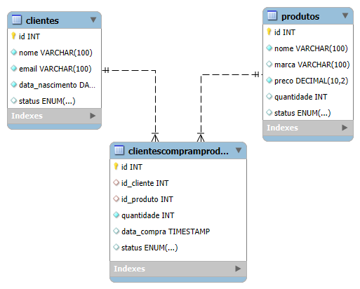

# Documentação da API de Gerenciamento de Clientes e Produtos

## Índice
1. [Como Rodar o Projeto](#como-rodar-o-projeto)
2. [Dependências](#dependências)
3. [Estrutura da API](#estrutura-da-api)
4. [Modelagem do Banco de Dados](#modelagem-do-banco-de-dados)
5. [Endpoints da API](#endpoints-da-api)

---

## Como Rodar o Projeto

### Passo 1: Clonar o Repositório

Clone o repositório do projeto para o seu ambiente local:

```bash
git clone https://github.com/adimael/api-ecommerce-express.git
````

## Passo 2: Instalar as Dependências

```
cd api-ecommerce-express-main
npm install
```

## Passo 3: Configurar o Arquivo .env

### Crie um arquivo `.env` na raiz do projeto e configure as variáveis de ambiente:

- DB_HOST=localhost
- DB_USER=root
- DB_PASSWORD=sua_senha
- DB_NAME=nome_do_banco

##

## Passo 4: Iniciar o Servidor
### Para rodar o servidor em modo de desenvolvimento, utilize o Nodemon. No terminal, execute o seguinte comando:
```
npm start
```
A API estará disponível em http://localhost:3000

##

## Dependências

### As dependências utilizadas neste projeto são:

- express: Framework web para Node.js.
- mysql2: Cliente MySQL para Node.js.
- dotenv: Carrega variáveis de ambiente de um arquivo .env.
- nodemon: Ferramenta para reiniciar o servidor automaticamente durante o desenvolvimento.

## Dependências no package.json:

````
{
  "dependencies": {
    "dotenv": "^16.4.5",
    "express": "^4.21.1",
    "mysql2": "^3.11.5",
    "nodemon": "^3.1.7"
  },
  "scripts": {
    "start": "nodemon server.js"
  },
  "name": "project",
  "version": "1.0.0",
  "main": "server.js",
  "keywords": [],
  "author": "Adimael",
  "license": "ISC",
  "description": ""
````

##

## Estrutura da API

```
/src
  /controllers
    clienteController.js
    produtoController.js
    clientesCompramProdutosController.js
  /routes
    clienteRoutes.js
    produtoRoutes.js
    clientesCompramProdutosRoutes.js
  /database
    database.js
server.js
.env
package.json
```

## Descrição da Estrutura:

- /controllers: Contém os arquivos responsáveis pela lógica de manipulação dos dados e respostas da API.
- /routes: Define as rotas para os endpoints da API.
- /database: Configura a conexão com o banco de dados MySQL.
- server.js: Arquivo principal que inicializa o servidor Express e configura as rotas.
- .env: Arquivo de variáveis de ambiente para configuração do banco de dados.

##

## Modelagem do Banco de Dados

### O banco de dados utilizado é um MySQL, com três tabelas principais: clientes, produtos e ClientesCompramProdutos.

<p align="center">

</p>


### Tabela: `clientes`

````
CREATE TABLE clientes (
  id INT AUTO_INCREMENT PRIMARY KEY,
  nome VARCHAR(255) NOT NULL,
  email VARCHAR(255) NOT NULL,
  telefone VARCHAR(15) NOT NULL,
  status ENUM('ativo', 'inativo') NOT NULL
);
````

### Tabela: `produtos`

````
CREATE TABLE produtos (
  id INT AUTO_INCREMENT PRIMARY KEY,
  nome VARCHAR(255) NOT NULL,
  marca VARCHAR(255) NOT NULL,
  preco DECIMAL(10, 2) NOT NULL,
  quantidade INT NOT NULL,
  status ENUM('ativo', 'inativo') NOT NULL
);
````

### Tabela: `ClientesCompramProdutos`

### Esta tabela cria o relacionamento entre clientes e produtos, representando quais produtos foram comprados por quais clientes.

````
CREATE TABLE ClientesCompramProdutos (
    id INT AUTO_INCREMENT PRIMARY KEY,
    id_cliente INT,
    id_produto INT,
    quantidade INT NOT NULL,
    data_compra TIMESTAMP DEFAULT CURRENT_TIMESTAMP,
    status ENUM('finalizado', 'cancelado') DEFAULT 'finalizado',
    UNIQUE (id_cliente, id_produto), -- Garantir que a combinação de cliente e produto seja única
    FOREIGN KEY (id_cliente) REFERENCES Clientes(id),
    FOREIGN KEY (id_produto) REFERENCES Produtos(id)
);
````


##

## Endpoints da API

### Clientes

- POST /clientes: Cadastrar um cliente.
- GET /clientes: Listar todos os clientes.
- GET /clientes/:id: Buscar um cliente pelo ID.
- PUT /clientes/:id: Atualizar um cliente.
- DELETE /clientes/:id: Deletar um cliente.

### Produtos

- POST /produtos: Cadastrar um produto.
- GET /produtos: Listar todos os produtos.
- GET /produtos/:id: Buscar um produto pelo ID.
- PUT /produtos/:id: Atualizar um produto.
- DELETE /produtos/:id: Deletar um produto.

### Compras

- POST /compras: Registrar a compra de um produto por um cliente.